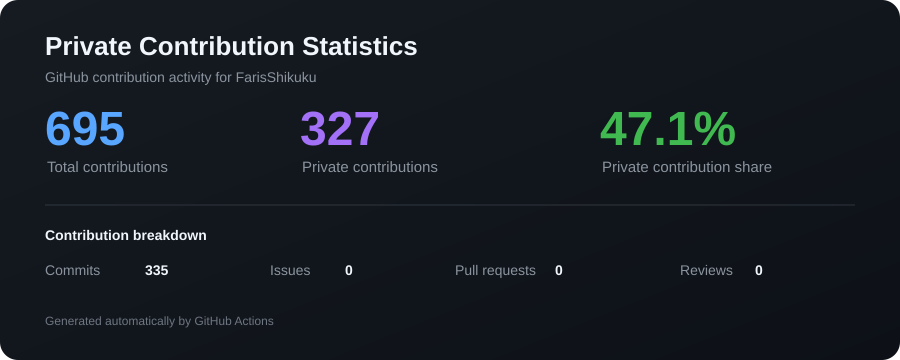

# 👋 Hi, I'm Faris Shikuku

  <b>Systems Architect · Applied Physics & Computer Science</b> 
  Building intelligent, data-driven systems for finance, energy, simulation, and automation.

  I bridge physics, mathematics, and software engineering to build simulation engines,
  algorithmic trading infrastructure, AI workflows, and scalable full-stack systems.

  
  
  

---

## 🧠 Engineering Focus

| Domain | Focus |
|---|---|
| ⚡ **Smart Energy** | Physics-based grid simulation, PV modeling, battery optimization, load forecasting |
| 📈 **Algorithmic Trading** | Signal extraction, MT5 backtesting, risk modeling, execution infrastructure |
| 🤖 **ML & Data** | Time-series forecasting, pattern recognition, constraint optimization |
| 🏗 **System Architecture** | Distributed services, event-driven pipelines, APIs, database-driven workflows |
| 📱 **Cross-Platform** | Desktop, mobile, web, and cloud systems from a coherent architecture |

---

## 📊 Self-Hosted GitHub Analytics

These cards are generated by GitHub Actions and committed directly to this repository.

  

### 🔐 Private Contribution Statistics

The following card is generated locally in GitHub Actions from the GitHub GraphQL API using a private repository secret. It exposes aggregate counts only.

  

> **Privacy:** Private repository names, source code, commit messages, and private repository URLs are never rendered into this card.

---

## 🐍 Contribution Activity

  <picture>
    <source media="(prefers-color-scheme: dark)" srcset="./assets/github-contribution-grid-snake-dark.svg">
    <source media="(prefers-color-scheme: light)" srcset="./assets/github-contribution-grid-snake.svg">
    
  </picture>

---

## 🚀 Featured Projects

### 💹 NEXUS — Trading Signal Infrastructure
Trading signal management platform combining desktop tooling, web interfaces, signal extraction, and event-driven processing.

- WinUI 3 desktop application
- Electron + React frontend
- Telegram signal extraction pipeline
- Redis Streams architecture
- Confidence-scored signal parsing
- Backtesting and execution workflows

### ⚡ NexGrid — Smart Energy Simulation
Physics-driven energy simulation and optimization platform.

- Renewable-energy modeling
- PV generation simulation
- Battery storage optimization
- Load forecasting
- Grid behavior simulation
- Responsive and accessibility-focused UI

### 🤖 ARIA — AI Diagnostic Agent
AI workflow platform designed for real-time diagnostic support.

- FastAPI
- Google Cloud Run
- Agent/workflow orchestration
- Real-time diagnostic support
- Cloud-native architecture

### 🧾 Sphere SmartAI POS
Full point-of-sale platform built around a structured relational data model and service-oriented backend.

- 48-table relational schema
- FastAPI service layer
- Inventory and sales workflows
- Role-based access
- Reporting and analytics

### 📅 Sphere Schedule
Full-stack scheduling and workflow platform.

- Next.js
- .NET 8
- JWT authentication
- Role-based workflows
- Scheduling and task management
- API-driven architecture

---

## 📌 Featured Repositories

These mirror the repositories currently pinned on my GitHub profile.

| Repository | Description | Stack |
|---|---|---|
| [FxInvestment-Windows-WinUI](https://github.com/FarisShikuku/FxInvestment-Windows-WinUI) | Investment portfolio account manager | C# |
| [FxInvestmentmobile](https://github.com/FarisShikuku/FxInvestmentmobile) | Android investment portfolio manager | Java |
| [telegram-signal-copier-and-backtester](https://github.com/FarisShikuku/telegram-signal-copier-and-backtester) | Telegram signal parsing, execution and backtesting | Python |
| [Sphere-Schedule-windows-winui](https://github.com/FarisShikuku/Sphere-Schedule-windows-winui) | Sphere Schedule Windows client | C# |
| [Sphere-Schedule-AndroidUI](https://github.com/FarisShikuku/Sphere-Schedule-AndroidUI) | Sphere Schedule Android UI prototype | Android |
| [SmartEnergy-Desktop](https://github.com/FarisShikuku/SmartEnergy-Desktop) | Smart-grid and renewable-energy simulation | Python |

---

## 🛠 Technology Stack

### Languages

### Backend & Data

### Cloud & DevOps

### AI & Data Science

---

## 🎯 Current Interests

- Quantitative Finance
- Smart Grid Optimization
- Reinforcement Learning
- High-Performance Computing
- Distributed Systems
- AI Agents & Autonomous Workflows
- Energy Infrastructure Modeling
- Algorithmic Trading Systems

---

## 📫 Connect

  
  
  

---

## 💡 Engineering Philosophy

> **Build systems that transform complexity into clarity.**

I combine physics, mathematics, data, and software engineering to turn complex real-world problems into measurable, automatable systems.

  <i>Model · Simulate · Optimize · Automate</i>

